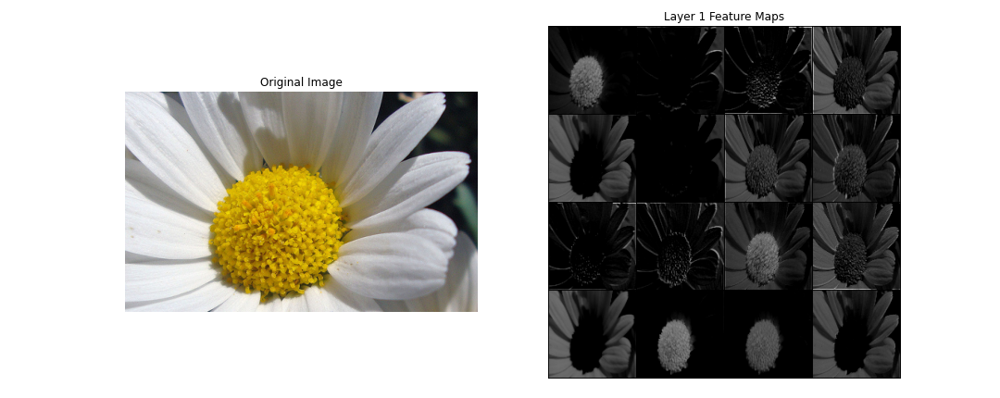

# 🌼 Flower Classification Project

This repository contains the implementation and evaluation of various deep learning models for flower classification. It is a midterm project for the course SE3508 Introduction to Artificial Intelligence, instructed by Dr. Selim Yılmaz at Muğla Sıtkı Koçman University, Department of Software Engineering (2025 Spring Term).

## 🚀 Project Overview

In this project, five categories of flowers (daisy, dandelion, rose, sunflower, tulip) are classified using image data and deep learning. Three model architectures were implemented and compared:
- A custom-designed Convolutional Neural Network (CNN)
- A pre-trained VGG16 model used as a feature extractor
- A fine-tuned version of VGG16 for flower-specific learning

## 📁 Project Structure

```
flower-classification-se3508/
├── dataset/                # Local dataset directory (Store your dataset here. You can obtain the dataset from Kaggle or the specified links.)
├── models/                 # Trained model weights (.pth)
│   └── model_weights.txt    # You can download the model weights via the Google Drive link.
├── notebooks/
│   └── flower_classification.ipynb   # Main notebook
├── plots/                            # Evaluation results (e.g., training/validation curves, confusion matrices, feature visualizations)
│   ├── custom_cnn/                   # Custom CNN model plots
│   ├── vgg_feature_extractor/        # VGG16 feature extractor model plots
│   ├── vgg_fine_tuned/               # VGG16 fine-tuned model plots
│   └── model_comparison/             # Model Comparison Plots
├── src/
│   ├── __init__.py
│   ├── data.py                    # Data preprocessing, augmentations
│   ├── models.py                  # Model definitions
│   ├── train.py                   # Training + validation loops
│   └── visualization.py           # Feature and prediction visualizations
├── requirements.txt              # Required Python packages
└── README.md                     # Project report and documentation
```

## 🧠 Model Architectures

Three different model strategies were implemented and evaluated:

### 1️⃣ Custom CNN Model

Custom-designed from scratch with 5 convolutional layers and fully connected layers.
Highlights:

- Hierarchical feature learning (edges → patterns).
- Batch Normalization and Max Pooling used to stabilize and regularize training.

### 2️⃣ VGG16 - Feature Extractor

- Pre-trained VGG16 on ImageNet; all convolutional layers frozen.
- Only the classifier layer was trained on the flower dataset.

### 3️⃣ VGG16 - Fine-Tuned

First convolutional block frozen; deeper convolutional layers and classifier fine-tuned.
Allows adaptation of features to flower-specific characteristics.

## 🌸 Dataset

The [Flowers Dataset](https://www.kaggle.com/datasets/imsparsh/flowers-dataset/data) from Kaggle was used, which includes five categories:
- Contains 5 classes: daisy, dandelion, rose, sunflower, tulip
- 4242 images total, varying in resolution and lighting
- Dataset split: 70% train, 15% validation, 15% test

📌 How to access the dataset:
- Download manually from Kaggle
- Extract into the root directory under dataset/flowers/

## 📈 Training Results and Visualizations

### 1️⃣ Custom CNN Model

**💡 Model Weight Saving and Selection**

<div>
During the training process, I saved the model weights at the end of each epoch. This decision was made to safeguard against unexpected overfitting or underfitting situations. By saving the weights periodically, I could choose the model with the best performance on the validation set, which ensures that I always had access to the most optimal model during the training process.

Since I saved the model weights at each epoch, I was able to select the model with the highest validation accuracy from all three models. This method allowed me to select the best-performing model without risking overfitting or underfitting.
</div>

**🔥 Training and Validation Curves**

<div style="display: flex; justify-content: space-around;">
  
  
</div>
After analyzing the training graphs, I decided to select the 20th epoch. At this point, I observed a significant increase in validation accuracy and a noticeable decrease in validation loss. Since there was no major gap between the training and validation curves, I can conclude that there was no serious overfitting issue. Additionally, the fact that validation loss started to plateau or fluctuate after the 20th epoch indicated that my model’s generalization ability was no longer improving. The validation F1-score also reached its highest value at this epoch. I believed that continuing training beyond this point would result in unnecessary computational cost and increase the risk of overfitting. Therefore, by setting the number of epochs to 20, I achieved a good balance between model performance and computational efficiency.

<br>
<br>
<br>

**🧩 Confusion Matrix**

<div>
  
</div>
The CustomCNN model showed the highest accuracy for daisy (83%) and sunflower (81%), followed by dandelion (76%) and tulip (75%). The lowest accuracy was for rose (64%), with a notable 21% misclassification as tulip. Other class confusions remained below 10%. Overall, the model performed well but needs improvement in distinguishing roses from tulips.

<br>
<br>
<br>

**🧠 Feature Maps**




### 2️⃣ VGG16 - Feature Extractor

**🔥 Training and Validation Curves**

<div style="display: flex; justify-content: space-around;">
  
  
</div>
When analyzing the training graphs, I decided to select the 4th epoch for the VGG16 Feature Extractor model. At this point, the validation accuracy reached one of its highest values (approximately 88%) and started to decline afterward. Similarly, the validation loss approached its minimum value at the 4th epoch and then began to increase. This clearly indicates that the model started to overfit after the 4th epoch. While the training accuracy continued to improve and the training loss continued to decrease, the opposite behavior in the validation metrics suggests that the model began to excessively fit the training data and lost its generalization ability. Therefore, to use computational resources more efficiently and to maintain the highest possible generalization performance, I decided to stop the training at the 4th epoch.

<br>
<br>
<br>

**🧩 Confusion Matrix**
<div>
  
</div>
The VGG16 Feature Extractor model outperformed CustomCNN, achieving 93% accuracy for dandelion, 92% for rose and sunflower, 89% for daisy, and 80% for tulip. The rose class, previously weak, improved significantly. However, a 14% confusion between tulip and rose persists. Other misclassifications remained low, generally under 4%. Overall, the model demonstrated the effectiveness of transfer learning with more consistent and higher accuracy across all classes.

### 3️⃣ VGG16 - Fine-Tuned

**🔥 Training and Validation Curves**

<div style="display: flex; justify-content: space-around;">
  
  
</div>
When analyzing the training graphs for the VGG16 Fine-Tuned model, I observed that the best results were achieved at the 2nd epoch. At this point, the validation accuracy had significantly increased to 92%, and the validation loss had dropped to one of its minimum levels (around 0.21). In the following epochs, while the training accuracy continued to increase, the validation accuracy started to fluctuate and generally declined. Similarly, the validation loss began to rise after the 2nd epoch. The large gap between the training and validation metrics (with training accuracy ranging from 96% to 99% and validation accuracy fluctuating between 88% and 92%) indicated that the model was overfitting to the training data and its generalization ability was weakening. Therefore, even though I did not stop the training early, I chose to use the model weights from the 2nd epoch for performance evaluation, as this point represented the model’s best generalization performance before overfitting started.

<br>
<br>
<br>

**🧩 Confusion Matrix**
<div>
  
</div>
The VGG16 Fine-Tuned model achieved even higher performance than previous models, with 96% accuracy for dandelion, 94% for sunflower, 92% for daisy, and 90% for tulip. Although rose had a slightly lower accuracy at 89%, it showed a major improvement compared to CustomCNN. The tulip-rose confusion dropped to 9%, and overall class confusion significantly decreased. Fine-tuning further enhanced transfer learning, enabling over 90% accuracy across nearly all classes and optimizing model performance.

<br>
<br>
<br>

**🧠 Feature Maps**


## 📊 Performance Comparison

The table below summarizes the performance comparison of the three models:

| Model                     | Accuracy | Precision | Recall | F1     | Training Time (s)   |
|---------------------------|----------|-----------|--------|--------|---------------------|
| Custom CNN                | 0.7618   | 0.7643    | 0.7618 | 0.7621 | 774.57              |
| VGG16 (Feature Extractor) | 0.8836   | 0.8898    | 0.8836 | 0.8842 | 474.04              |
| VGG16 (Fine-Tuned)        | 0.9218   | 0.9229    | 0.9218 | 0.9220 | 11060.42            |

Among the three models, VGG16 Fine-Tuned achieved the highest accuracy, precision, recall, and F1 score, showing the most balanced performance. However, it took significantly longer to train compared to the other models. While CustomCNN had the shortest training time, its performance was lower. VGG16_Feature_Extractor offered a good balance with improved results over CustomCNN. Overall, transfer learning, especially fine-tuning, significantly enhanced model performance and classification accuracy, although it came at the cost of a longer training duration.

## ⚙️ Setup & Usage

1. Install required libraries:
```bash
pip install -r requirements.txt
```

2. Download the flower dataset from Kaggle and extract it into a folder named `dataset`:
```
https://www.kaggle.com/datasets/imsparsh/flowers-dataset/data
```

3. Launch Jupyter Lab:
```bash
jupyter lab
```

4. Open and run `notebooks/flower_classification.ipynb`.

